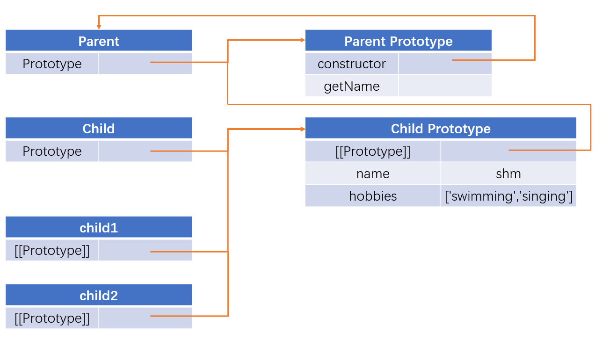
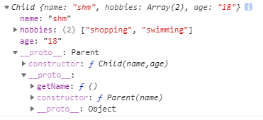

### 原型链继承

- 方法：本质是重写子类的原型对象，这个原型对象是通过创建父类的实例，并赋值给子类的原型对象实现的。

  即：```Child.prototye = new Parent();```

- 缺点：1. 引用类型的属性会被所有实例所共享；2. 在创建Child实例时不能向 Parent 传参

- 注意：原型链继承时不能使用对象字面量创建原型方法，这样会重写原型链，导致继承的代码无效。

- 实现

  ```js
   function Parent() {
       this.name = 'shm';
       this.hobbies = ['swimming','singing'];
   }
  Parent.prototype.getName = function() {
      console.log(this.name);
  }
  function Child(){}
  Child.prototype = new Parent();//实现继承
  //注意：不能使用对象字面量添加原型方法（如下），上面继承的语句会失效
  //Child.prototype = {
  //    getHobbies： function(){...}
  //}
  //测试
  var child1 = new Child();
  child1.hobbies.push('aaa');
  child1.name = 'aviva';//child1新添加了一个name属性
  console.log(child1.hobbies);//[ 'shopping', 'swimming', 'aaa' ]
  console.log(child1.name);//aviva
  
  var child2 = new Child();
  console.log(child2.hobbies);//[ 'shopping', 'swimming', 'aaa' ]
  console.log(child2.name);//shm，child2中本身没有，去原型对象中获得的值
  ```



### 构造函数继承（借用 call/apply 函数/伪造对象/经典继承）

- 方法：在子类构造函数中通过 call/apply 调用父类构造函数

  `function SubType(){ SuperType.call(this);}//继承了SuperType `

- 优点：1. 避免了引用类型的值被所有实例共享；2. 可以在子类中向父类传参（通过call/apply）

- 缺点：1. 不能继承父类原型中定义的方法；2. 方法都在构造函数中定义，每次创建实例都会重新创建一遍，浪费内存。

- 实现:

  ```js
  function Parent(name) {
    this.name = name;
    this.hobbies = ['shopping','swimming'];
  }
  function Child(name) {
    Parent.call(this,name);//在子类构造函数里调用父类构造函数，
    // 所以继承了父类的name属性，但是由于更改了this，所以Parent里的this指向每个child实例
    //因此每个实例都会有自己的属性副本
  }
  var child1 = new Child('shm');
  child1.hobbies.push('aaa');
  console.log(child1.hobbies);//[ 'shopping', 'swimming', 'aaa' ]
  console.log(child1.name);//shm
  
  var child2 = new Child('aviva');
  console.log(child2.hobbies);//[ 'shopping', 'swimming' ]
  console.log(child2.name);//aviva
  ```

### 组合继承（伪经典继承：原型链+构造函数继承）

- 方法：通过原型链继承父类原型对象的属性和方法，通过构造函数继承父类构造函数内的属性。

  ```js
  function Child(name,age) {
    Parent.call(this,name);//构造函数继承，这里继承了name属性
    this.age = age;
  }
  Child.prototype = new Parent();//原型链继承；第一次调用父类构造函数：设置类型实例的原型的时候
  ```

- 优点：使每个子类实例分别拥有自己的属性，又可以使用相同的方法。融合了原型链继承和构造函数的优点，是最常用的继承方法

- 缺点：1. 调用了两次父类构造函数（一次使设置子类原型的时候，另一次使创建子类实例的时候）-> 会有两组父类构造函数的属性（一组在子类原型上，一组在子类实例中）；2. 父类原型和子类原型是同一个对象，无法区分子类实例真正由谁构造。

- 实现

  ```js
  function Parent(name) {
    this.name = name;
    this.hobbies = ['shopping','swimming'];
  }
  Parent.prototype.getName = function () {//通过原型链共享的方法
    console.log(this.name);
  };
  function Child(name,age) {
    Parent.call(this,name);//构造函数继承，这里继承了name属性
    this.age = age;
  }
  Child.prototype = new Parent();//原型链继承；第一次调用父类构造函数：设置类型实例的原型的时候
  Child.prototype.constructor = Child;
  //测试
  var child1 = new Child('shm','18');//第二次调用父类构造函数：创建子类实例的时候
  child1.hobbies.push('singing');
  console.log(child1.name);//shm
  console.log(child1.age);//18
  console.log(child1.hobbies);//[ 'shopping', 'swimming', 'singing' ]
  child1.getName();
  
  var child2 = new Child('aviva','20');
  console.log(child2.name);//aviva
  console.log(child2.age);//20
  console.log(child2.hobbies);//[ 'shopping', 'swimming' ]
  child2.getName();
  //父类原型和子类原型是同一个对象，无法区分子类实例真正由谁构造。
  console.log(child1 instanceof Parent);//true
  console.log(child1 instanceof Child);//true
  ```

### 原型式继承

- 方法：通过```Object.create(o)```实现，将传入的o对象作为其它对象创建的基础，即o作为新创建对象的原型，本质上就是对o进行一层浅拷贝。且必须有一个对象作为基础。

  ```js
  //Object.create的模拟实现
  function createObj(o){
      function F(){};
      F.prototype = o;
      return new F();
  }
  ```

- 缺点：和原型（链）继承一样，包含引用类型的属性始终都会共享相应的值

- 实现

  ```js
  function createObj(o) {
    function F() {}
    F.prototype = o;
    return new F();
  }
  //person是其它对象创建的基础
  var person = {
    name: 'shm',
    friends: ['daisy', 'kelly']
  };
  var person1 = createObj(person);//或者用Object.create(person)
  var person2 = createObj(person);
  console.log(person1);//{} 虽然打印为空对象，但是可以通过原型链找到name和friends属性
  person1.name = 'person1';
  console.log(person1.name);//person1
  console.log(person2.name);//shm
  console.log(person1);//{ name: 'person1' }
  //这里person1和2的name不同不是因为他们具有独立的name，而是因为给person1添加了name，并非修改了原型的name
  
  person1.friends.push('taylor');
  console.log(person1.friends);//[ 'daisy', 'kelly', 'taylor' ]
  console.log(person2.friends);//[ 'daisy', 'kelly', 'taylor' ]
  ```

### 寄生式继承

- 方法：创建一个仅用于封装继承过程的函数，该函数在内部以某种形式来做增强对象（给对象添加新的属性/方法），最后返回对象

  ```js
  function createObj(o){
      let clone = Object.create(o);
      //在这里做增强对象
      clone.sayHi = function(){
          console.log('Hi');
      }
      return clone;
  }
  ```

- 缺点：与借用构造函数继承一样，函数不能复用；与原型链/原型式继承一样，引用类型的属性会被共享

- 实现

  ```js
  function createObj(o) {
    var clone = Object.create(o);
    clone.sayName = function () {
      console.log('hi');
    };
    return clone;
  }
  var person = {
    name: 'shm',
    friends: ['daisy', 'kelly']
  };
  var person1 = createObj(person);
  var person2 = createObj(person);
  person1.name = 'aviva';
  person1.friends.push('aaa');
  console.log(person1.name);//aviva
  console.log(person2.name);//shm
  console.log(person1.friends);//['daisy', 'kelly','aaa']
  console.log(person2.friends);//['daisy', 'kelly','aaa']
  ```

### 寄生组合式继承（最优）

- 方法：在组合继承的基础上，子类继承一个由父类原型生成的空对象。用 `inheritPrototype` 方法替代组合继承中`SubType.prototype = new SuperType()`

  ```js
  function inheritPrototype(SubType,SuperType){
      let prototype = Object.create(SuperType.prototype);//创建父类原型的一个副本
      prototype.constructor = SubType;//为创建的副本添加constructor属性，弥补因重写原型而失去的默认的constructor属性
      SubType.prototype = prototype;//将新创建的对象（即副本）赋值给子类的原型
  }
  ```

- 优点：1. 只调用了一次父类构造函数，并且因此避免了在子类原型上面创建不必要的多余的属性；2. 原型链保持不变，因此可以正常使用 `instanceof` 和 `isPrototypeOf`

- 实现

  ```js
  function Parent(name) {
    this.name = name;
    this.hobbies = ['shopping','swimming'];
  }
  Parent.prototype.getName = function () {
    console.log(this.name);
  };
  function Child(name,age) {
    Parent.call(this,name);//借用构造函数继承
    this.age = age;
  }
  function inherits(child,parent) {
    child.prototype = Object.create(parent.prototype,{
      constructor: {
        value: child
      }
    })
  }
  inherits(Child,Parent);
  
  var child1 = new Child('shm','18');
  console.log(child1);//子类实例上只有name，hobbies和age属性，方法在Parent原型上，子类原型上没有
  ```



### Class 继承

```js
class Parent {
  constructor(value) {
    this.val = value
  }
  getValue() {
    console.log(this.val)
  }
}
class Child extends Parent {
  constructor(value) {
    super(value)
  }
}
let child = new Child(1)
child.getValue() // 1
child instanceof Parent // true
```

`class` 实现继承的核心在于使用 `extends` 表明继承自哪个父类，并且在子类构造函数中必须调用 `super`，因为这段代码可以看成 `Parent.call(this, value)`。

`class` 创建的函数必须要用 `new` 关键词实现，它内部有特殊的内部属性`[[FunctionKind]]:"classConstructor"`；类方法不可枚举，类定义将 `"prototype"` 中的所有方法的 `enumerable` 标志设置为 `false`。；类总是使用严格模式。

如果要重写 constructor，那么必须要先调用 `super` 来完成 `this` 的赋值，因为在`class` 的情况下 `this` 赋值要由非派生类实现。这是由于派生的构造函数具有特殊的内部属性 `[[ConstructorKind]]:"derived"`。

📖：高程三，其他（忘了）

