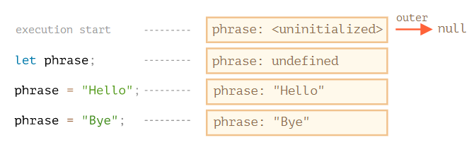
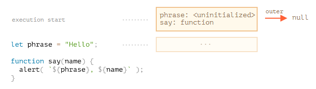
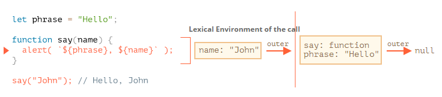
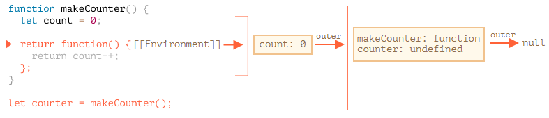
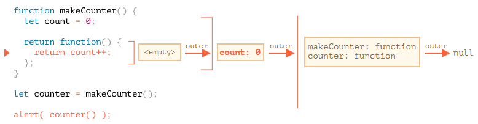

### 词法环境 Lexical Environment

#### 变量

所有运行的 function、代码块 `{...}` 和整个脚本内部都有一个隐藏的关联对象——词法环境。

词法环境对象包括两部分：

1. **环境记录（Environment Record）** —— 一个存储所有局部变量作为其属性（包括一些其他信息，例如 `this` 的值）的对象。

2. 对 **外部词法环境** 的引用，与外部代码相关联。

> **A “variable” is just a property of the special internal object, `Environment Record`. “To get or change a variable” means “to get or change a property of that object”.**

**一个“变量”实际上只是环境记录器的一个属性。获取或修改这个变量意味着获取或修改这个对象的属性。**

词法环境仅仅是一个规范对象，不是实际存在的无法在代码中获取与操作，主要用于描述事物如何运作的对象。

栗子🌰



左侧是一个全局代码，右侧是一个词法环境对象，方格表示环境记录，outer 表示外部引用。

1. 当脚本开始运行，词法环境预先填充了所有声明的变量。
   - 最初，它们处于“未初始化（Uninitialized）”状态。这是一种特殊的内部状态，这意味着引擎知道变量，但是不允许在 `let` 之前使用它。几乎就像变量不存在一样。
2. 然后 `let phrase` 定义出现了。还未被赋值，值为 `undefined`。从这刻起，就可以使用这个变量。
3. `phrase` 被赋予了一个值。
4. `phrase` 的值被修改。

#### 函数声明

函数也是一个变量，不同的是，只要词法环境被创建，函数声明会立即变为可用的函数，即立即被初始化，所以可以在函数定义之前就使用它。

🌰



但这不适用于函数表达式的形式，即  `let say = function(name)...` 这种方式于变量的情况一致。

#### 内部与外部词法环境

当一个函数被调用时，会创建一个新的词法环境用以存储这个调用的局部变量和参数。

🌰



此时有两个词法环境：内部一个（用于函数调用）和外部一个（全局）。内部词法环境引用了 `outer`。

**当代码要访问一个变量时 —— 首先会搜索内部词法环境，然后搜索外部环境，然后搜索更外部的环境，以此类推，直到全局词法环境。**

如果在任何地方都找不到这个变量，那么在严格模式下会报错，在非严格模式下，为了向后兼容，则会在全局环境创建一个未赋值的变量。

#### 返回函数

🌰



此时有两个词法环境，一个全局词法环境，一个是 `makeCounter()` 被调用时产生的。

所有的函数都有一个内置属性 `[[Environment]]`，这个属性指向创建这个函数的词法环境。即 `Counter.[[Environment]]` 指向 `{count: 0}` 词法环境。

当调用 `counter()` 时，会为该调用创建一个新的词法环境，并且根据 `counter.[[Environment]]` 获取到它的外部词法环境引用。



并且在变量所在的词法环境中修改变量的值。

### 闭包 Closure

闭包是指内部函数总是可以访问它所在的外部函数中声明的变量和参数，即使在它外部函数被返回之后。在 JS 中除 `new Function` 语法外的所有函数都是天生闭包。 这是因为 JavaScript 中的函数会自动通过隐藏的 `[[Environment]]` 属性记住它们被创建的位置，所以它们都可以访问外部变量。

在 JS 中用 `new Function` 创建的函数的 `[[Environment]]` 属性指向的是全局词法环境，而不是函数所在的外部词法环境。因此，不能在 `new Function` 中直接使用外部变量，需要显式地参数传值，这样可以降低代码出错的可能，避免了使用压缩程序而产生冲突的问题。

优点：

1. 闭包可以突破作用域链的限制，将函数内部的变量和方法传递到外部；
2. 避免全局变量的污染；

缺点：

1. 常驻在内存中，增加了内存的使用量；
2. 虽然闭包可以突破作用域链传到外部，但是这样传出来的变量不能被修改，这一问题可以通过函数属性来解决（如下）。

如果变量位于外层的函数中，那么这个变量只能被这个函数和这个函数内部嵌套的函数修改，外部的函数无法修改它。此时可以通过利用函数属性，即将变量绑定到函数上，那么外部就也可以修改了。

🌰 `count` 只可以被 `makeCounter` 和内部的函数修改

```javascript
function makeCounter() {
  let count = 0;

  return function() {
    return count++;
  };
}

let counter = makeCounter();

alert( counter() ); // 0
alert( counter() ); // 1
alert( counter() ); // 2
```

使用函数属性来代替闭包。

``` js
function makeCounter() {
    function counter() {
        return counter.count++;
    }
    counter.count = 0;
    return counter;
}
let counter = makeCounter();
counter.count = 10;
alter( counter() );//10
```

### 垃圾回收 Garbage collection

通常，函数调用完成后，会将词法环境和其中的所有变量从内存中删除。与 JavaScript 中的其他对象一样，词法环境仅在可达时才会被保留在内存中。

但是，如果某个函数在执行结束后，它的这个词法环境仍然被引用，即依旧可达，那么它依旧会存在再变量中。

🌰

```javascript
function f() {
  let value = 123;

  return function() {
    alert(value);
  }
}

let g = f(); // g.[[Environment]] 存储了对相应 f() 调用的词法环境的引用
g = null;// 此时 f() 的词法环境不再被引用，即可被垃圾回收机制回收
```

理论上当函数可达时，它外部的所有变量也都将存在。但实际上，JS 引擎进行了进一步的优化，JS 引擎会分析变量的使用情况，如果这个变量明显不会被使用，那么也会被移除。因此，这类变量在 V8（Chorm/Oprea） 中调试时将不可用。


📖：[Variable Scope](https://javascript.info/closure)

